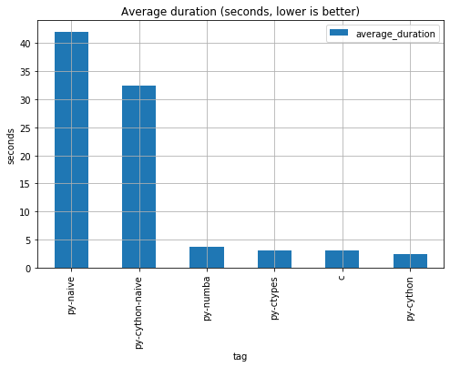

# Python Simple Prime Test

This repository attempts to answer the question:
> Is Python too slow?

* Short answer: Yes.
* Long answer: Still yes. But you got options!
    * Adding numba decorators & compiling your code (LLVM)
    * Adding cython type annotations & compiling your code (C)
    * Leveraging an external c implementation with ctypes.



## Benchmark: prime number test

Consider a simple function to test if a number is prime:
> Given a number `n` find if there's a divisor in the first `n/2` numbers.

Of course, we can come with a better prime-testing solution, but we won't.
This solution is exactly what we need: inefficient and cpu-intensive.

The goal: Compare the python implementation to a pure C solution.

C implementation:

```c
int isPrime(int num) {
    for(int i=2; i<=num/2; i++)
	    if (!(num%i))
            return 0;
    return 1;
}
```

This translates to python as:

```python
def is_prime(n: int) -> int:
    for i in range(2, (n // 2) + 1):
        if not (n % i):
            return 0
    return 1
```

## Benchmark results

As expected, plain vanilla python is painfully slow. By compiling the plain python code without and modification via `cython` 
we can get a 29% performance increase. If we don't bother adding a simple numba decorator, we can get a 10X performance 
increase. These 2 solutions are the easiest to implement because doesn't require changing our `is_prime` function definitions and requires
minimal boilerplate.

If you want even better performance:
* Use directly a c external function via Python CTypes.
* Add cython type annotations before compiling.

| benchmark_tag   | samples | min_duration | average_duration | max_duration |
|-----------------|---------|--------------|------------------|--------------|
| py-naive        | 10.0    | 41.59      | 41.93         | 42.68      |
| py-cython-naive | 10.0    | 32.15      | 32.40         | 32.94      |
| py-numba        | 10.0    | 3.71       | 3.75          | 3.87       |
| py-ctypes       | 10.0    | 3.03        | 3.08           | 3.16       |
| c               | 10.0    | 3.04     | 3.05          | 3.07     |
| py-cython       | 10.0    | 2.39       | 2.42          | 2.44       |

## Installation

These tests were performed using `python 3.7.5`. We recommend creating a virtualenv and
installing the dependencies:

```commandline
$ pip install -r requirements.txt
```

## Setup

We need to compile the `c`, `numba` & `cython` implementation. For this, simple run:

```commandline
$ bash build.sh --c
```
* The expected output is a `bencharkc` file.
* Alternatively: `gcc -o benchmarkc benchmark.c`

```commandline
$ bash build.sh --py-numba
```
* The expected output is a `numba_impl.*` file.
* Alternatively: `python numba_source.py`

```commandline
$ bash build.sh --py-cython
```
* Expected output are the compiled code for `cython_impl.py` and `cython_naive_impl.py`.

## Run the benchmarks

Run benchmarks individually:
* C: `bash run.sh --c`
* Python Naive: `bash run.sh --py-naive`
* Python Numba: `bash run.sh --py-numba`
* Python Cython: `bash run.sh --py-cython`
* Python CTypes: `bash run.sh --py-ctypes`

Or run all at once:

```commandline
BENCH_PARALLELISM=false python benchmarks.py 1
```
* The output will be appended to a file: `benchmark-outputs-xxxx.json`
* Each benchmark is executed on an independent process. If `BENCH_PARALLELISM` is `false`, then the processes will be executed sequentially.
* Change the `1` if you want to run each benchmark more than once (consider that different processes will be used for each).
